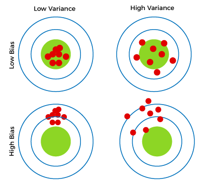
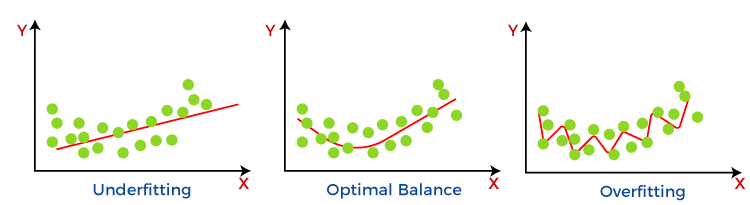

# Additional Terms

## Feature Scaling

- Feature scaling, essentially dividing each positive feature by its maximum value, or more generally, rescale each feature by both its minimum and maximum values using (x-min)/(max-min). Both ways normalizes features to the range of -1 and 1, where the former method works for positive features which is simple and serves well for the lecture's example, and the latter method works for any features.
- Mean normalization: $x_i := \dfrac{x_i - \mu_i}{max - min} $ 
- Z-score normalization

### z-score normalization 
After z-score normalization, all features will have a mean of 0 and a standard deviation of 1.

To implement z-score normalization, adjust your input values as shown in this formula:
$x^{(i)}_j = \dfrac{x^{(i)}_j - \mu_j}{\sigma_j} \tag{4}$

where $j$ selects a feature or a column in the $\mathbf{X}$ matrix. $µ_j$ is the mean of all the values for feature (j) and $\sigma_j$ is the standard deviation of feature (j).

$\mu_j = \frac{1}{m} \sum_{i=0}^{m-1} x^{(i)}_j$

$\sigma^2_j = \frac{1}{m} \sum_{i=0}^{m-1} (x^{(i)}_j - \mu_j)^2$

## Overfitting and Underfitting

### Bias

While making predictions, a difference occurs between prediction values made by the model and actual values/expected values, and this difference is known as bias errors or Errors due to bias. It can be defined as an inability of machine learning algorithms such as Linear Regression to capture the true relationship between the data points.

### Variance

Variance tells that how much a random variable is different from its expected value.Ideally, a model should not vary too much from one training dataset to another, which means the algorithm should be good in understanding the hidden mapping between inputs and output variables. Variance errors are either of low variance or high variance.

  

Reasons for Underfitting
* High bias and low variance.
* The size of the training dataset used is not enough.
* The model is too simple.
* Training data is not cleaned and also contains noise in it.

Techniques to Reduce Underfitting

* Increase model complexity.
* Increase the number of features, performing feature engineering.
* Remove noise from the data.
* Increase the number of epochs or increase the duration of training to get better results.

Reasons for Overfitting
    
* High variance and low bias.
* The model is too complex.
* The size of the training data.

Techniques to Reduce Overfitting

* Increase training data.
* Reduce model complexity.
* Early stopping during the training phase (have an eye over the loss over the training period as soon as loss begins to increase stop training).
* Ridge Regularization and Lasso Regularization.
* Use dropout for neural networks to tackle overfitting.

## Regularization

Regularization is a technique used to combat overfitting of the model to the training set data.

### Cost function for regularized linear regression

The equation for the cost function regularized linear regression is:
$$J(\mathbf{w},b) = \frac{1}{2m} \sum\limits_{i = 0}^{m-1} (f_{\mathbf{w},b}(\mathbf{x}^{(i)}) - y^{(i)})^2  + \frac{\lambda}{2m}  \sum_{j=0}^{n-1} w_j^2 \tag{1}$$ 
where:
$f_{\mathbf{w},b}(\mathbf{x}^{(i)}) = \mathbf{w} \cdot \mathbf{x}^{(i)} + b  \tag{2}$

Compare this to the cost function without regularization , which is of the form:

$$J(\mathbf{w},b) = \frac{1}{2m} \sum\limits_{i = 0}^{m-1} (f_{\mathbf{w},b}(\mathbf{x}^{(i)}) - y^{(i)})^2 $$ 

The difference is the regularization term,  
    $\frac{\lambda}{2m}  \sum_{j=0}^{n-1} w_j^2$  
    
Including this term encourages gradient descent to minimize the size of the parameters. 

### Cost function for regularized logistic regression
For regularized **logistic** regression, the cost function is of the form
$$J(\mathbf{w},b) = \frac{1}{m}  \sum_{i=0}^{m-1} \left[ -y^{(i)} \log\left(f_{\mathbf{w},b}\left( \mathbf{x}^{(i)} \right) \right) - \left( 1 - y^{(i)}\right) \log \left( 1 - f_{\mathbf{w},b}\left( \mathbf{x}^{(i)} \right) \right) \right] + \frac{\lambda}{2m}  \sum_{j=0}^{n-1} w_j^2 \tag{3}$$ 
where:
$f_{\mathbf{w},b}(\mathbf{x}^{(i)}) = sigmoid(\mathbf{w} \cdot \mathbf{x}^{(i)} + b)  \tag{4}$ 

Compare this to the cost function without regularization:

$$ J(\mathbf{w},b) = \frac{1}{m}\sum_{i=0}^{m-1} \left[ (-y^{(i)} \log\left(f_{\mathbf{w},b}\left( \mathbf{x}^{(i)} \right) \right) - \left( 1 - y^{(i)}\right) \log \left( 1 - f_{\mathbf{w},b}\left( \mathbf{x}^{(i)} \right) \right)\right] $$ 

As was the case in linear regression above, the difference is the regularization term, which is    
    $\frac{\lambda}{2m}  \sum_{j=0}^{n-1} w_j^2$  

### Computing the Gradient with regularization (both linear/logistic)
The gradient calculation for both linear and logistic regression are nearly identical, differing only in computation of $f_{\mathbf{w}b}$.
$\frac{\partial J(\mathbf{w},b)}{\partial w_j}  = \frac{1}{m} \sum\limits_{i = 0}^{m-1} (f_{\mathbf{w},b}(\mathbf{x}^{(i)}) - y^{(i)})x_{j}^{(i)}  +  \frac{\lambda}{m} w_j \tag{2}$
$\frac{\partial J(\mathbf{w},b)}{\partial b}  = \frac{1}{m} \sum\limits_{i = 0}^{m-1} (f_{\mathbf{w},b}(\mathbf{x}^{(i)}) - y^{(i)}) \tag{3} $

* m is the number of training examples in the data set      
* $f_{\mathbf{w},b}(x^{(i)})$ is the model's prediction, while $y^{(i)}$ is the target

      
* For a   **linear**  regression model  
    $f_{\mathbf{w},b}(x) = \mathbf{w} \cdot \mathbf{x} + b$  
* For a  **logistic**  regression model  
    $z = \mathbf{w} \cdot \mathbf{x} + b$  
    $f_{\mathbf{w},b}(x) = g(z)$  
    where $g(z)$ is the sigmoid function:  
    $g(z) = \frac{1}{1+e^{-z}}$   
    
The term which adds regularization is  the $\frac{\lambda}{m} w_j $.
