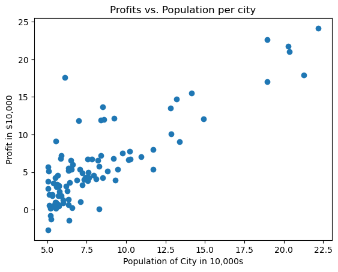
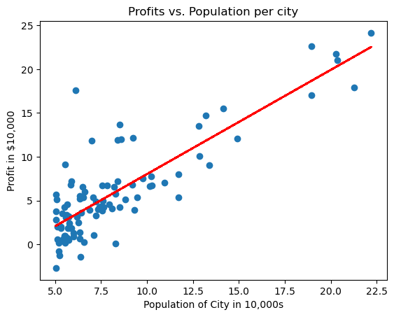

# Linear Regression

Packages used:
- [numpy](www.numpy.org) is the fundamental package for working with matrices in Python.
- [matplotlib](http://matplotlib.org) is a famous library to plot graphs in Python.


```python
import numpy as np
import matplotlib.pyplot as plt
```


```python
data = np.loadtxt("data/ex1data1.txt", delimiter=',')
x_train= data[:,0]
y_train= data[:,1]
```


```python
print("Type of x_train:",type(x_train))
print("First five elements of x_train are:\n", x_train[:5]) 
```

    Type of x_train: <class 'numpy.ndarray'>
    First five elements of x_train are:
     [6.1101 5.5277 8.5186 7.0032 5.8598]
    

- These values represent the city population times 10,000
- For example, 6.1101 means that the population for that city is 61,101


```python
print("Type of y_train:",type(y_train))
print("First five elements of y_train are:\n", y_train[:5])  
```

    Type of y_train: <class 'numpy.ndarray'>
    First five elements of y_train are:
     [17.592   9.1302 13.662  11.854   6.8233]
    

- These represent your restaurant's average monthly profits in each city, in units of \$10,000.
  - For example, 17.592 represents \$175,920 in average monthly profits for that city.
  - -2.6807 represents -\$26,807 in average monthly loss for that city.


```python
print ('The shape of x_train is:', x_train.shape)
print ('The shape of y_train is: ', y_train.shape)
print ('Number of training examples (m):', len(x_train))
```

    The shape of x_train is: (97,)
    The shape of y_train is:  (97,)
    Number of training examples (m): 97
    

## Visualizing data

It is often useful to understand the data by visualizing it. 
- For this dataset, we can use a scatter plot to visualize the data, since it has only two properties to plot (profit and population). 


```python
plt.scatter(x_train, y_train) 

# Set the title
plt.title("Profits vs. Population per city")
# Set the y-axis label
plt.ylabel('Profit in $10,000')
# Set the x-axis label
plt.xlabel('Population of City in 10,000s')
plt.show()
```


    

    


- The model function for linear regression, which is a function that maps from `x` to `y`  is represented as 
    $$f_{w,b}(x) = wx + b$$
    

- To train a linear regression model, you want to find the best $(w,b)$ parameters that fit your dataset.  

    - To compare how one choice of $(w,b)$ is better or worse than another choice, you can evaluate it with a cost function $J(w,b)$
      - $J$ is a function of $(w,b)$. That is, the value of the cost $J(w,b)$ depends on the value of $(w,b)$.
  
    - The choice of $(w,b)$ that fits your data the best is the one that has the smallest cost $J(w,b)$.


- To find the values $(w,b)$ that gets the smallest possible cost $J(w,b)$, you can use a method called **gradient descent**. 
  - With each step of gradient descent, your parameters $(w,b)$ come closer to the optimal values that will achieve the lowest cost $J(w,b)$.
  

- The trained linear regression model can then take the input feature $x$ (city population) and output a prediction $f_{w,b}(x)$ (predicted monthly profit for a restaurant in that city).


## Compute Cost

Gradient descent involves repeated steps to adjust the value of your parameter $(w,b)$ to gradually get a smaller and smaller cost $J(w,b)$.
- At each step of gradient descent, it will be helpful for you to monitor your progress by computing the cost $J(w,b)$ as $(w,b)$ gets updated. 

### Cost function
For one variable, the cost function for linear regression $J(w,b)$ is defined as

$$J(w,b) = \frac{1}{2m} \sum\limits_{i = 0}^{m-1} (f_{w,b}(x^{(i)}) - y^{(i)})^2$$ 


### Model prediction

- For linear regression with one variable, the prediction of the model $f_{w,b}$ for an example $x^{(i)}$ is representented as:

$$ f_{w,b}(x^{(i)}) = wx^{(i)} + b$$

This is the equation for a line, with an intercept $b$ and a slope $w$

.


```python
def compute_cost(x, y, w, b): 
    
    # number of training examples
    m = x.shape[0] 
    
    total_cost = 0
    
    for i in range (m):
        total_cost+=(w*x[i]+b-y[i])**2
    total_cost/=2*m
    

    return total_cost
```


```python
initial_w = 2
initial_b = 1

cost = compute_cost(x_train, y_train, initial_w, initial_b)
print(type(cost))
print(f'Cost at initial w: {cost:.3f}')
```

    <class 'numpy.float64'>
    Cost at initial w: 75.203
    


## Gradient descent 

the gradient descent algorithm is:

$$\begin{align*}& \text{repeat until convergence:} \; \lbrace \newline \; & \phantom {0000} b := b -  \alpha \frac{\partial J(w,b)}{\partial b} \newline       \; & \phantom {0000} w := w -  \alpha \frac{\partial J(w,b)}{\partial w} \tag{1}  \; & 
\newline & \rbrace\end{align*}$$

where, parameters $w, b$ are both updated simultaniously and where  
$$
\frac{\partial J(w,b)}{\partial b}  = \frac{1}{m} \sum\limits_{i = 0}^{m-1} (f_{w,b}(x^{(i)}) - y^{(i)}) \tag{2}
$$
$$
\frac{\partial J(w,b)}{\partial w}  = \frac{1}{m} \sum\limits_{i = 0}^{m-1} (f_{w,b}(x^{(i)}) -y^{(i)})x^{(i)} \tag{3}
$$
* m is the number of training examples in the dataset

    
*  $f_{w,b}(x^{(i)})$ is the model's prediction, while $y^{(i)}$, is the target value


Implementing a function called `compute_gradient` which calculates $\frac{\partial J(w)}{\partial w}$, $\frac{\partial J(w)}{\partial b}$ 


```python
def compute_gradient(x, y, w, b): 

    # number of training examples
    m = x.shape[0]
    
    dj_dw = 0
    dj_db = 0
    
    for i in range(m):
        dj_db+=w*x[i]+b-y[i]
        dj_dw+=(w*x[i]+b-y[i])*x[i]
    dj_db/=m
    dj_dw/=m
        
    return dj_dw, dj_db
```


```python
initial_w = 0
initial_b = 0

tmp_dj_dw, tmp_dj_db = compute_gradient(x_train, y_train, initial_w, initial_b)
print('Gradient at initial w, b (zeros):', tmp_dj_dw, tmp_dj_db)
```

    Gradient at initial w, b (zeros): -65.32884974555672 -5.83913505154639
    


```python
# Compute and display cost and gradient with non-zero w
test_w = 0.2
test_b = 0.2
tmp_dj_dw, tmp_dj_db = compute_gradient(x_train, y_train, test_w, test_b)

print('Gradient at test w, b:', tmp_dj_dw, tmp_dj_db)
```

    Gradient at test w, b: -47.41610118114435 -4.007175051546391
    

## Batch gradient descent

Finding the optimal parameters of a linear regression model by using batch gradient descent.

- A good way to verify that gradient descent is working correctly is to look
at the value of $J(w,b)$ and check that it is decreasing with each step. 

- Assuming an appropriate value for the learning rate alpha, $J(w,b)$ should never increase and should converge to a steady value by the end of the algorithm.


```python
import math

def gradient_descent(x, y, w_in, b_in, cost_function, gradient_function, alpha, num_iters): 
    
    # number of training examples
    m = len(x)
    
    # An array to store cost J and w's at each iteration
    J_history = []
    w_history = []
    w = w_in
    b = b_in
    
    for i in range(num_iters):

        # Calculate the gradient and update the parameters
        dj_dw, dj_db = gradient_function(x, y, w, b )  

        # Update Parameters using w, b, alpha and gradient
        w = w - alpha * dj_dw               
        b = b - alpha * dj_db               

        # Save cost J at each iteration
        if i<100000:      # prevent resource exhaustion 
            cost =  cost_function(x, y, w, b)
            J_history.append(cost)

        # Print cost every at intervals 10 times or as many iterations if < 10
        if i% math.ceil(num_iters/10) == 0:
            w_history.append(w)
            print(f"Iteration {i:4}: Cost {float(J_history[-1]):8.2f}   ")
        
    return w, b, J_history, w_history #return w and J,w history for graphing
```


```python
initial_w = 0.
initial_b = 0.

iterations = 2500
alpha = 0.01

w,b,_,_ = gradient_descent(x_train ,y_train, initial_w, initial_b, 
                     compute_cost, compute_gradient, alpha, iterations)
print("w,b found by gradient descent:", w, b)
```

    Iteration    0: Cost     6.74   
    Iteration  250: Cost     5.06   
    Iteration  500: Cost     4.71   
    Iteration  750: Cost     4.57   
    Iteration 1000: Cost     4.52   
    Iteration 1250: Cost     4.49   
    Iteration 1500: Cost     4.48   
    Iteration 1750: Cost     4.48   
    Iteration 2000: Cost     4.48   
    Iteration 2250: Cost     4.48   
    w,b found by gradient descent: 1.1886434853952736 -3.8520806813360893
    


```python
m = x_train.shape[0]
predicted = np.zeros(m)

for i in range(m):
    predicted[i] = w * x_train[i] + b
```


```python
plt.plot(x_train, predicted, c = "r")

# Create a scatter plot of the data. 
plt.scatter(x_train, y_train) 

# Set the title
plt.title("Profits vs. Population per city")
# Set the y-axis label
plt.ylabel('Profit in $10,000')
# Set the x-axis label
plt.xlabel('Population of City in 10,000s')
```


    Text(0.5, 0, 'Population of City in 10,000s')


    

    


# Linear Regression using Scikit-Learn

Utilizing  scikit-learn to implement linear regression using Gradient Descent


```python
from sklearn.linear_model import SGDRegressor
from sklearn.preprocessing import StandardScaler
```


```python
x_train = data[:, 0:1]
y_train= data[:,1]
```

### Scale/normalize the training data


```python
scaler = StandardScaler()
x_norm = scaler.fit_transform(x_train)
```

### Create and fit the regression model


```python
sgdr = SGDRegressor(max_iter=1500)
sgdr.fit(x_train,y_train)
b_norm = sgdr.intercept_
w_norm = sgdr.coef_
print(f"model parameters:                   w: {w_norm}, b:{b_norm}")
```

    model parameters:                   w: [1.0277434], b:[-2.63776465]
    


```python
for i in range(m):
    predicted[i] = w * x_train[i] + b
    plt.plot(x_train, predicted, c = "r")

# Create a scatter plot of the data. 
plt.scatter(x_train, y_train) 

# Set the title
plt.title("Profits vs. Population per city")
# Set the y-axis label
plt.ylabel('Profit in $10,000')
# Set the x-axis label
plt.xlabel('Population of City in 10,000s')
```


    Text(0.5, 0, 'Population of City in 10,000s')


    

    


```python

```
