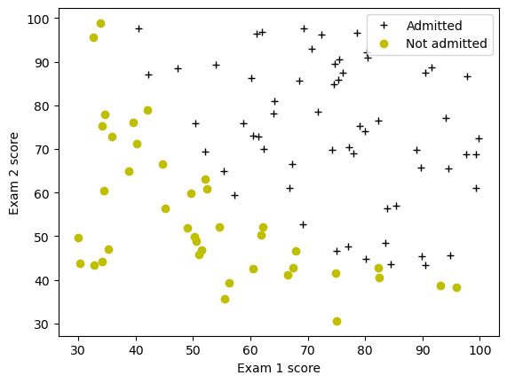

# Logistic Regression


```python
import numpy as np
import matplotlib.pyplot as plt
import math
```

Building a logistic regression model to predict whether a student gets admitted into a university.


Data that is present
* Historical data from previous applicants. 
* For each training example, the applicant’s scores on two exams and the admissions decision. 

Building a classification model that estimates an applicant’s probability of admission based on the scores from those two exams. 


```python
data = np.loadtxt("data/ex2data1.txt", delimiter=',')
X_train = data[:,:2]
y_train = data[:,2]
```


```python
print("First five elements in X_train are:\n", X_train[:5])
print("Type of X_train:",type(X_train))
```

    First five elements in X_train are:
     [[34.62365962 78.02469282]
     [30.28671077 43.89499752]
     [35.84740877 72.90219803]
     [60.18259939 86.3085521 ]
     [79.03273605 75.34437644]]
    Type of X_train: <class 'numpy.ndarray'>
    


```python
print("First five elements in y_train are:\n", y_train[:5])
print("Type of y_train:",type(y_train))
```

    First five elements in y_train are:
     [0. 0. 0. 1. 1.]
    Type of y_train: <class 'numpy.ndarray'>
    


```python
print ('The shape of X_train is: ' + str(X_train.shape))
print ('The shape of y_train is: ' + str(y_train.shape))
print ('We have m = %d training examples' % (len(y_train)))
```

    The shape of X_train is: (100, 2)
    The shape of y_train is: (100,)
    We have m = 100 training examples
    

## Visualizing the Data


```python
pos_label="Admitted"
neg_label="Not admitted"
positive = y_train == 1
negative = y_train == 0
    
# Plot examples
plt.plot(X_train[positive, 0], X_train[positive, 1], 'k+', label=pos_label)
plt.plot(X_train[negative, 0], X_train[negative, 1], 'yo', label=neg_label)

# Set the y-axis label
plt.ylabel('Exam 2 score') 
# Set the x-axis label
plt.xlabel('Exam 1 score') 
plt.legend(loc="upper right")
plt.show()
```


    

    


The goal is to build a logistic regression model to fit this data.

## Sigmoid function

For logistic regression, the model is represented as

$$ f_{\mathbf{w},b}(x) = g(\mathbf{w}\cdot \mathbf{x} + b)$$
where function $g$ is the sigmoid function. The sigmoid function is defined as:

$$g(z) = \frac{1}{1+e^{-z}}$$


```python
def sigmoid(z):
          
    g=1/(1+np.exp(-z))
    
    return g
```

## Cost function for logistic regression

Implementing the cost function for logistic regression.

For logistic regression, the cost function is of the form 

$$ J(\mathbf{w},b) = \frac{1}{m}\sum_{i=0}^{m-1} \left[ loss(f_{\mathbf{w},b}(\mathbf{x}^{(i)}), y^{(i)}) \right] \tag{1}$$

where
* m is the number of training examples in the dataset


* $loss(f_{\mathbf{w},b}(\mathbf{x}^{(i)}), y^{(i)})$ is the cost for a single data point, which is - 

    $$loss(f_{\mathbf{w},b}(\mathbf{x}^{(i)}), y^{(i)}) = (-y^{(i)} \log\left(f_{\mathbf{w},b}\left( \mathbf{x}^{(i)} \right) \right) - \left( 1 - y^{(i)}\right) \log \left( 1 - f_{\mathbf{w},b}\left( \mathbf{x}^{(i)} \right) \right) \tag{2}$$
    
    
*  $f_{\mathbf{w},b}(\mathbf{x}^{(i)})$ is the model's prediction, while $y^{(i)}$, which is the actual label


```python
def compute_cost(X, y, w, b, *argv):

    m, n = X.shape
    
    total_cost=0
    
    for i in range(m):
        z_wb=0
        z_wb=np.dot(X[i],w)+b
        f_wb=sigmoid(z_wb)
        loss=-y[i]*np.log(f_wb)-(1-y[i])*np.log(1-f_wb)
        total_cost+=loss
    total_cost/=m


    return total_cost
```


```python
m, n = X_train.shape

# Compute and display cost with w and b initialized to zeros
initial_w = np.zeros(n)
initial_b = 0.
cost = compute_cost(X_train, y_train, initial_w, initial_b)
print('Cost at initial w and b (zeros): {:.3f}'.format(cost))
```

    Cost at initial w and b (zeros): 0.693
    


```python
# Compute and display cost with non-zero w and b
test_w = np.array([0.2, 0.2])
test_b = -24.
cost = compute_cost(X_train, y_train, test_w, test_b)

print('Cost at test w and b (non-zeros): {:.3f}'.format(cost))
```

    Cost at test w and b (non-zeros): 0.218
    

## 2.5 Gradient for logistic regression

Implementing the gradient for logistic regression.

The gradient descent algorithm is:

$$\begin{align*}& \text{repeat until convergence:} \; \lbrace \newline \; & b := b -  \alpha \frac{\partial J(\mathbf{w},b)}{\partial b} \newline       \; & w_j := w_j -  \alpha \frac{\partial J(\mathbf{w},b)}{\partial w_j} \tag{1}  \; & \text{for j := 0..n-1}\newline & \rbrace\end{align*}$$

where, parameters $b$, $w_j$ are all updated simultaniously

$$
\frac{\partial J(\mathbf{w},b)}{\partial b}  = \frac{1}{m} \sum\limits_{i = 0}^{m-1} (f_{\mathbf{w},b}(\mathbf{x}^{(i)}) - \mathbf{y}^{(i)}) \tag{2}
$$
$$
\frac{\partial J(\mathbf{w},b)}{\partial w_j}  = \frac{1}{m} \sum\limits_{i = 0}^{m-1} (f_{\mathbf{w},b}(\mathbf{x}^{(i)}) - \mathbf{y}^{(i)})x_{j}^{(i)} \tag{3}
$$
* m is the number of training examples in the dataset

    
*  $f_{\mathbf{w},b}(x^{(i)})$ is the model's prediction, while $y^{(i)}$ is the actual label


```python
def compute_gradient(X, y, w, b, *argv): 
    
    m, n = X.shape
    dj_dw = np.zeros(w.shape)
    dj_db = 0.

    
    for i in range(m):
        z_wb = 0
        for j in range(n): 
            z_wb += X[i][j]*w[j]
        z_wb += b
        f_wb = sigmoid(z_wb)
        
        dj_db_i = f_wb-y[i]
        dj_db += dj_db_i
        
        for j in range(n):
            dj_dw[j] += dj_db_i*X[i][j]
            
    dj_dw = dj_dw/m
    dj_db = dj_db/m
   

        
    return dj_db, dj_dw
```


```python
# Compute and display gradient with w and b initialized to zeros
initial_w = np.zeros(n)
initial_b = 0.

dj_db, dj_dw = compute_gradient(X_train, y_train, initial_w, initial_b)
print(f'dj_db at initial w and b (zeros):{dj_db}' )
print(f'dj_dw at initial w and b (zeros):{dj_dw.tolist()}' )
```

    dj_db at initial w and b (zeros):-0.1
    dj_dw at initial w and b (zeros):[-12.00921658929115, -11.262842205513591]
    


```python
# Compute and display cost and gradient with non-zero w and b
test_w = np.array([ 0.2, -0.5])
test_b = -24
dj_db, dj_dw  = compute_gradient(X_train, y_train, test_w, test_b)

print('dj_db at test w and b:', dj_db)
print('dj_dw at test w and b:', dj_dw.tolist())
```

    dj_db at test w and b: -0.5999999999991071
    dj_dw at test w and b: [-44.831353617873795, -44.37384124953978]
    

## Finding parameters using gradient descent


```python
def gradient_descent(X, y, w_in, b_in, cost_function, gradient_function, alpha, num_iters, lambda_): 
    
    # number of training examples
    m = len(X)
    
    # An array to store cost J and w's at each iteration primarily for graphing later
    J_history = []
    w_history = []
    
    for i in range(num_iters):

        # Calculate the gradient and update the parameters
        dj_db, dj_dw = gradient_function(X, y, w_in, b_in, lambda_)   

        # Update Parameters using w, b, alpha and gradient
        w_in = w_in - alpha * dj_dw               
        b_in = b_in - alpha * dj_db              
       
        # Save cost J at each iteration
        if i<100000:      # prevent resource exhaustion 
            cost =  cost_function(X, y, w_in, b_in, lambda_)
            J_history.append(cost)

        # Print cost every at intervals 10 times or as many iterations if < 10
        if i% math.ceil(num_iters/10) == 0 or i == (num_iters-1):
            w_history.append(w_in)
            print(f"Iteration {i:4}: Cost {float(J_history[-1]):8.2f}   ")
        
    return w_in, b_in, J_history, w_history 
```


```python
np.random.seed(1)
initial_w = 0.01 * (np.random.rand(2) - 0.5)
initial_b = -8

# Some gradient descent settings
iterations = 10000
alpha = 0.001

w,b, J_history,_ = gradient_descent(X_train ,y_train, initial_w, initial_b, 
                                   compute_cost, compute_gradient, alpha, iterations, 0)
```

    Iteration    0: Cost     0.96   
    Iteration 1000: Cost     0.31   
    Iteration 2000: Cost     0.30   
    Iteration 3000: Cost     0.30   
    Iteration 4000: Cost     0.30   
    Iteration 5000: Cost     0.30   
    Iteration 6000: Cost     0.30   
    Iteration 7000: Cost     0.30   
    Iteration 8000: Cost     0.30   
    Iteration 9000: Cost     0.30   
    Iteration 9999: Cost     0.30   
    

## Evaluating logistic regression

We can evaluate the quality of the parameters we have found by seeing how well the learned model predicts on our training set.


```python
def predict(X, w, b): 
    
   
    m, n = X.shape   
    p = np.zeros(m)
   
     
    # Loop over each example
    for i in range(m):   
        z_wb = 0
        # Loop over each feature
        for j in range(n): 
            # Add the corresponding term to z_wb
            z_wb += X[i][j]*w[j]
        
        # Add bias term 
        z_wb += b
        
        # Calculate the prediction for this example
        f_wb = sigmoid(z_wb)

        # Apply the threshold
        p[i] = 1 if f_wb>=0.5 else 0
        
    return p
```

Now let's use this to compute the accuracy on the training set


```python
p = predict(X_train, w,b)
print('Train Accuracy: %f'%(np.mean(p == y_train) * 100))
```

    Train Accuracy: 92.000000
    


```python

```
